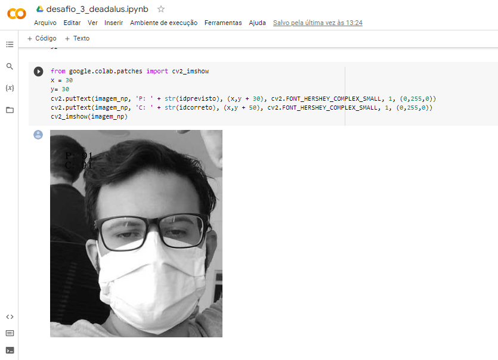

# Reconhecimento Facial - Desafio Deadalus

**O obetivo é fazer uma leitura e trinamento deum banco de 2997 subpastas e dentro de cada subpastas teria algumas imagens aleatorias com mascara aleatorias e sem mascara, dando um total de mais de 11 mil imagens. Objetivo principal e treinar o IA para poder identificar uma imagem especifica jogada junto as demais para poder ser identificada (A imagem e de marcelinho mais novo sem mascara e o IA vai buscar ele, e a imagem de busca é utilizando mascara, e assim foi feito com sucesso**

# 
